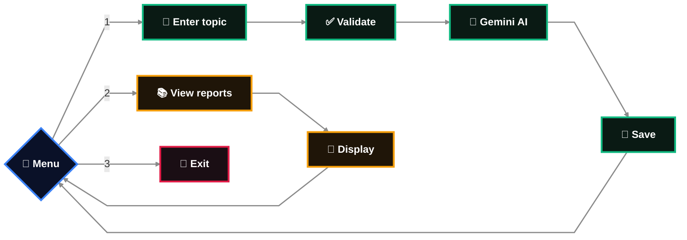

 

  

---

## About

*A Python application that researches any topic using Google Gemini and saves structured reports locally.*

Research Assistant lets users enter a topic, generate an AI-powered structured research report, and come back to view saved reports whenever they want.
  

---

## Features

* Enter any topic and receive a structured research report generated by Gemini
* Reports saved locally as JSON, with unique filenames so nothing gets overwritten
* View a single saved report or all saved reports at once
* Input validation for empty topics
* Error handling for invalid AI responses, missing reports, and corrupted JSON files
  

---

## Workflow

Blue is the menu, green is the research path from topic to saved report, amber is viewing what's already saved, and red is exit. Both paths loop back to the menu when they finish.
  

---

## Error handling

| Scenario | Response |
|---|---|
| Empty topic entered | `Please enter a valid research topic.` |
| Gemini returns invalid JSON | `Error: Gemini returned an invalid JSON response.` |
| AI request fails | `Research could not be generated. Please try again.` |
| No saved report found | `No saved research report found.` |
| Saved report file is corrupted | `Invalid JSON format in the research report.` |

  
---

## What this project demonstrates

Research Assistant combines several practical concepts into one working application: object-oriented design for representing a research report, API integration with an external AI service, environment variable management for API keys, JSON parsing for both AI responses and local storage, file handling for saving and loading reports, structured error handling across both AI and file failures, and datetime tracking for report timestamps.

---

